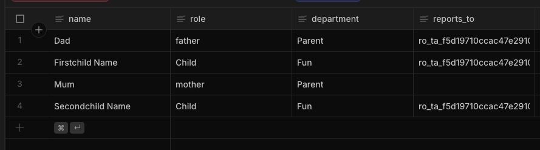
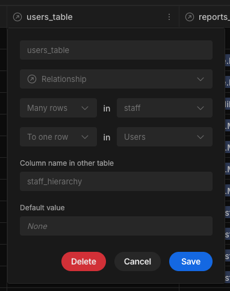
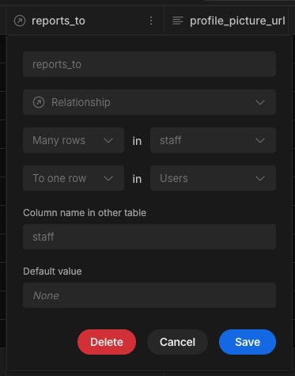
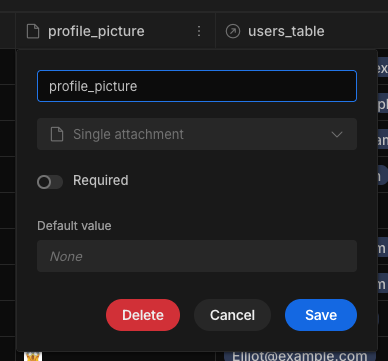
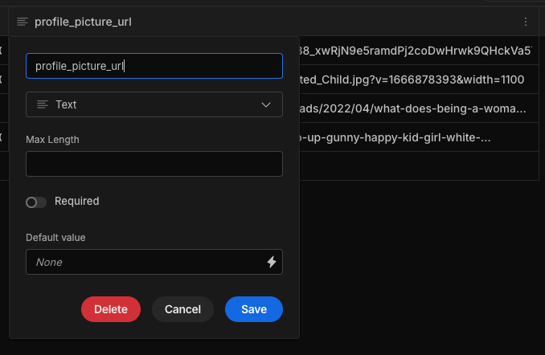

# Hierarchy-chart
This is a Budibase custom component plugin that uses the ApexCharts Tree Chart.

## Instructions

To build your new  plugin run the following in your Budibase CLI:
```
budi plugins --build
```

You can also re-build everytime you make a change to your plugin with the command:
```
budi plugins --watch
```

## To Get Started in Budibase
### Import the plugin

Import your plugin in your preferred way, as described [in the Budibase official documentation](https://docs.budibase.com/docs/custom-plugin).

### Structure your data
#### Basic Structure
The structure of your data is important. The simplest approach is for each row to have a "reports to" text column. This column should take the unique row ID (denoted as `_id`). You may leave one of these fields empty for the head of your chart (for example, the CEO). 



In the above example, Mum has no "reports_to" to value, which will put her at the head of the chart. Dad's `reports_to` value is the `_id` of Mum. The `reports_to` value for both of the children is the `_id` of Dad.

#### Complex Structure
If everyone you want to display in your Hierarchy Chart is a Budibase user, you can structure this by having two relationships to the Users table, firstly a straightforward  `users_table` relationship, and also a `reports_to` relationship. 

Users Table relationship - this should point to the row in the Users table that this row represents.



Reports To relationship - should point to the row in the users table that this row reports to. Can be left blank to depict being the head of the chart.


### Images
Each user can have an image displayed to represent them in the chart. This can either be passed as a single-attachment column, or simply as a text-field that takes an image URL.

Single attachment column:



Text field


## Setting up your component
Add a data provider to your screen which fetches the table that you sete up as denoted above.

Add a Hierarchy Chart to your screen, and set the `Provider` to your data provider.

Next, you'll be able to set up to three columns to show information, `Text Column 1`, `Text Column 2`, and `Text Column 3`, in my example these are used to show Name, Role, and Department. You should also select your Image column (either a single-attachment column or text column.)

The important part here is the `Parent Column` - this determines which rows in the table should appear as children of other rows. The head of the tree is, by default, set to be the row that does not have a value saved in "Parent Column" (ie does not report to anyone).

You may also wish to set `Top of Tree`, though it is not required. This field should also take a row `_id`, and will set that row as the head of the tree. This could be useful to take the entire table but pass in a state variable or URL parameter to show the structure of a specific department. This can also take bindings, meaning you could set this value using State or Clicked-row.
